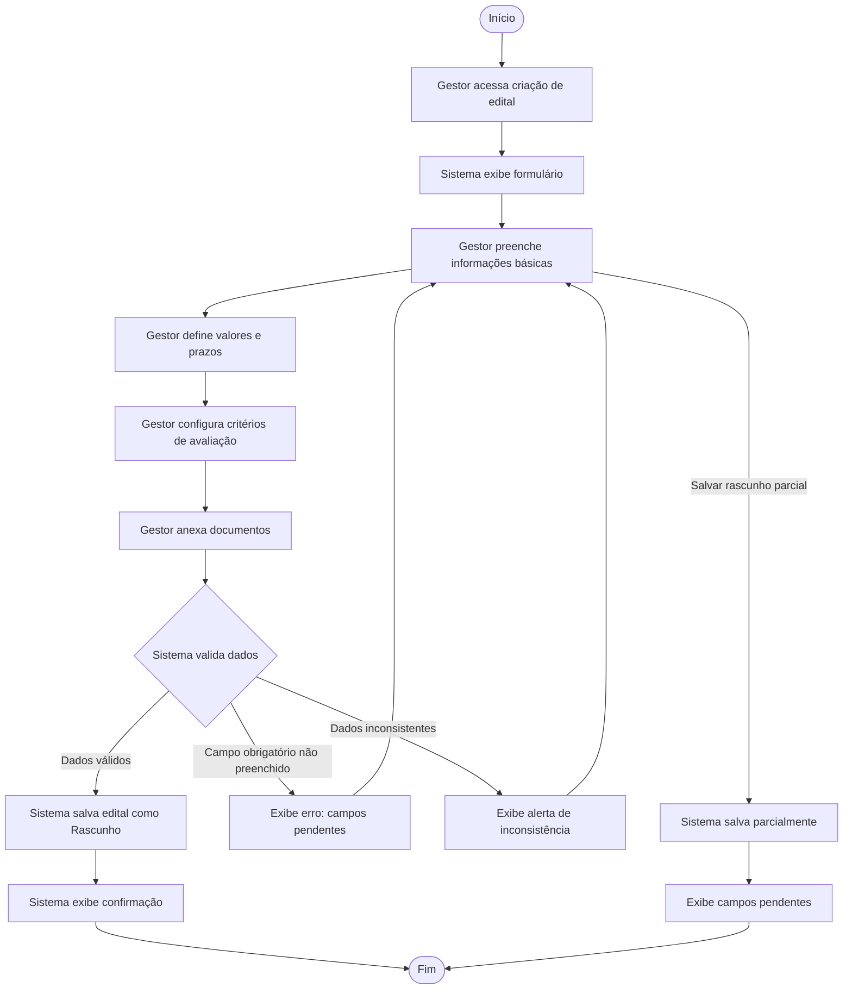

# UC01 - Criar e Configurar Edital

## Use-Case Specification

| Campo | Valor |
|-------|-------|
| **Caso de Uso** | UC01 - Criar e Configurar Edital |
| **Ator Primário** | Gestor do Edital |
| **Stakeholders e Interesses** | Órgão financiador (quer editais bem definidos), Proponentes (querem clareza nas regras) |
| **Versão** | 1.0 - Inception |

---

## 1. Descrição Breve

O Gestor do Edital cria um novo edital no sistema, definindo suas informações básicas, critérios de avaliação, prazos e valores de financiamento, configurando-o para posterior publicação.

---

## 2. Fluxo Básico de Eventos

1. O Gestor do Edital acessa a funcionalidade de criação de edital.
2. O sistema apresenta o formulário de criação.
3. O Gestor preenche as informações básicas do edital (título, descrição, área temática, público-alvo).
4. O Gestor define o valor total de financiamento e o valor máximo por projeto.
5. O Gestor define os prazos (período de submissão, período de avaliação, período de execução).
6. O Gestor configura os critérios de avaliação (pesos, pontuações, requisitos obrigatórios).
7. O Gestor anexa documentos complementares (regulamento, formulários, modelos).
8. O sistema valida as informações preenchidas.
9. O sistema salva o edital em estado de **Rascunho**.
10. O sistema exibe mensagem de confirmação.

---

## 3. Fluxos Alternativos

### 3.1 Dados Inválidos

- **3.1.1 Campo Obrigatório Não Preenchido**
  - No passo 8, se algum campo obrigatório não foi preenchido, o sistema exibe mensagem de erro indicando os campos pendentes.
  - O Gestor corrige os dados e retoma o fluxo no passo 4.

- **3.1.2 Dados Inconsistentes**
  - No passo 8, se os dados são inconsistentes (ex: data de início posterior à data de fim), o sistema exibe alerta.
  - O Gestor ajusta os dados e retoma o fluxo.

### 3.2 Salvar Parcialmente

- **3.2.1 Salvar Rascunho Incompleto**
  - Em qualquer passo entre 3 e 7, o Gestor pode optar por salvar o rascunho parcial.
  - O sistema salva o edital em estado de Rascunho com os dados preenchidos até o momento.
  - O sistema exibe mensagem indicando os campos pendentes para publicação.

### 3.3 Edital Duplicado

- **3.3.1 Criar Edital Baseado em Outro**
  - No passo 1, o Gestor pode optar por criar um edital baseado em um já existente.
  - O sistema carrega os dados do edital selecionado como template.
  - O fluxo continua no passo 3, com os campos preenchidos para edição.

---

## 4. Subfluxos

### 4.1 Configuração de Critérios de Avaliação

O Gestor, após definir as informações básicas do edital:
1. Acessa a seção "Critérios de Avaliação" no formulário.
2. Para cada critério que deseja adicionar:
   a. Informa o nome do critério (ex: "Viabilidade técnica", "Impacto social", "Orçamento adequado").
   b. Define o peso do critério (0 a 100, a soma total entre todos os critérios deve ser 100).
   c. Define a pontuação mínima e máxima para o critério (ex: 0 a 10).
   d. Marca se o critério é obrigatório/eliminatório (se a proposta não atingir o mínimo nesse critério, é automaticamente reprovada).
   e. Adiciona uma descrição detalhada do que será avaliado nesse critério.
3. O sistema exibe a soma dos pesos em tempo real e alerta se a soma for diferente de 100.
4. O Gestor pode reordenar os critérios arrastando-os (a ordem será exibida ao avaliador).
5. O Gestor pode remover ou editar um critério já adicionado a qualquer momento antes da publicação.
6. O Gestor confirma a configuração dos critérios e prossegue para a etapa seguinte do formulário.

### 4.2 Upload de Documentos Complementares

1. O Gestor acessa a seção "Documentos" no formulário.
2. Para cada documento complementar (regulamento, formulários padrão, modelos):
   a. Clica em "Adicionar documento".
   b. Seleciona o arquivo no formato PDF, DOCX ou XLSX (até 25 MB por arquivo).
   c. Informa um rótulo descritivo (ex: "Formulário de Submissão - Anexo I").
   d. Marca se o documento é obrigatório para o proponente preencher e reenviar.
3. O sistema exibe a lista de documentos anexados com nome, tamanho e status de upload.
4. O Gestor pode remover ou substituir um documento antes da publicação.

---

## 5. Cenários Chave

| Cenário | Descrição |
|---------|-----------|
| Criação completa | Gestor cria edital preenchendo todos os campos e salva rascunho |
| Criação parcial | Gestor salva rascunho incompleto para continuar depois |
| Criação por template | Gestor cria edital baseado em um existente |

---

## 6. Pré-condições

### 6.1 O Gestor do Edital deve estar autenticado no sistema.

### 6.2 O Gestor deve ter permissão para criar editais.

---

## 7. Pós-condições

### 7.1 O edital é salvo no sistema em estado de Rascunho.

### 7.2 Os critérios de avaliação ficam associados ao edital.

### 7.3 O histórico de criação é registrado para auditoria.

---

## 8. Pontos de Extensão

### 8.1 Configuração de Recursos

- Localização: Após o passo 7.
- O Gestor pode configurar o processo de análise de recursos (pedidos de revisão de decisões).

---

## 9. Requisitos Especiais

### 9.1 Os dados do edital devem ser persistidos de forma segura.

### 9.2 O sistema deve permitir upload de documentos em formatos PDF, DOCX e XLSX.

### 9.3 O salvamento automático de rascunho deve ocorrer a cada 2 minutos.

---

## 10. Informações Adicionais

### 10.1 Diagrama de Atividade

