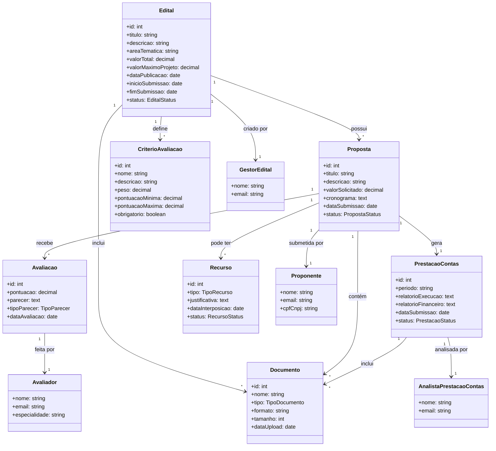

# Modelo de Domínio (Inicial)

## Plataforma de Gestão de Editais Públicos

| Campo | Valor |
|-------|-------|
| **Projeto** | Plataforma de Gestão de Editais Públicos |
| **Versão** | 1.0 - Inception |

---

## 1. Introdução

Este documento apresenta o modelo conceitual inicial do domínio da Plataforma de Gestão de Editais Públicos, identificando os principais conceitos, seus atributos e relacionamentos. O modelo está em nível de Inception e será refinado nas fases subsequentes.

---

## 2. Principais Conceitos

### 2.1 Edital

| Atributo | Tipo | Descrição |
|----------|------|-----------|
| id | Integer | Identificador único |
| titulo | String | Título do edital |
| descricao | String | Descrição detalhada |
| areaTematica | String | Área temática (esportivo, cultural, etc.) |
| valorTotal | Decimal | Valor total de financiamento |
| valorMaximoProjeto | Decimal | Valor máximo por projeto |
| dataPublicacao | Date | Data de publicação |
| inicioSubmissao | Date | Início do período de submissão |
| fimSubmissao | Date | Fim do período de submissão |
| status | Enum | Estado do ciclo de vida |

**Ciclo de Vida do Edital**:

```
Rascunho → Publicado → Em submissão → Em avaliação → Finalizado
```

### 2.2 Proposta / Projeto

| Atributo | Tipo | Descrição |
|----------|------|-----------|
| id | Integer | Identificador único |
| titulo | String | Título do projeto |
| descricao | String | Descrição do projeto |
| valorSolicitado | Decimal | Valor solicitado |
| cronograma | Text | Cronograma de execução |
| dataSubmissao | Date | Data de submissão |
| status | Enum | Estado do ciclo de vida |

**Ciclo de Vida do Projeto**:

```
Submetido → Em triagem → Em avaliação → Aprovado/Reprovado → Em execução → Prestação de contas → Encerrado
```

### 2.3 Critério de Avaliação

| Atributo | Tipo | Descrição |
|----------|------|-----------|
| id | Integer | Identificador único |
| nome | String | Nome do critério |
| descricao | String | Descrição do critério |
| peso | Decimal | Peso do critério na avaliação |
| pontuacaoMinima | Decimal | Pontuação mínima |
| pontuacaoMaxima | Decimal | Pontuação máxima |
| obrigatorio | Boolean | Se é critério eliminatório |

### 2.4 Avaliação

| Atributo | Tipo | Descrição |
|----------|------|-----------|
| id | Integer | Identificador único |
| pontuacao | Decimal | Pontuação atribuída |
| parecer | Text | Parecer do avaliador |
| tipoParecer | Enum | Favorável / Favorável com ressalvas / Desfavorável |
| dataAvaliacao | Date | Data da avaliação |

### 2.5 Prestação de Contas

| Atributo | Tipo | Descrição |
|----------|------|-----------|
| id | Integer | Identificador único |
| periodo | String | Período de referência |
| relatorioExecucao | Text | Relatório de execução |
| relatorioFinanceiro | Text | Relatório financeiro |
| dataSubmissao | Date | Data de submissão |
| status | Enum | Pendente / Em análise / Aprovada / Reprovada |

### 2.6 Documento

| Atributo | Tipo | Descrição |
|----------|------|-----------|
| id | Integer | Identificador único |
| nome | String | Nome do documento |
| tipo | Enum | Tipo (regulamento, proposta, comprovante, etc.) |
| formato | String | Formato do arquivo |
| tamanho | Integer | Tamanho em bytes |
| dataUpload | Date | Data de upload |

### 2.7 Recurso

| Atributo | Tipo | Descrição |
|----------|------|-----------|
| id | Integer | Identificador único |
| tipo | Enum | Tipo de recurso (contra resultado, contra inabilitação, etc.) |
| justificativa | Text | Justificativa do recurso |
| dataInterposicao | Date | Data de interposição |
| status | Enum | Pendente / Deferido / Indeferido |

---

## 3. Atores

| Ator | Descrição |
|------|-----------|
| Gestor do Edital | Cria, configura e gerencia editais |
| Proponente | Submete propostas e presta contas |
| Avaliador | Avalia propostas submetidas |
| Analista de Prestação de Contas | Analisa prestação de contas dos projetos |

---

## 4. Relacionamentos

```
Edital 1 ────── N Proposta
Edital 1 ────── N Critério de Avaliação
Edital 1 ────── N Documento
Proposta 1 ──── N Avaliação
Proposta 1 ──── 1 Proponente
Proposta 1 ──── N Documento
Proposta 1 ──── 1 Prestação de Contas (quando aprovada)
Prestação de Contas 1 ──── N Documento
Avaliação 1 ──── 1 Avaliador
Proposta 1 ──── N Recurso
```

---

## 5. Diagrama de Classes UML



---

## 6. Enumerações

### EditalStatus
- Rascunho
- Publicado
- Em submissão
- Em avaliação
- Finalizado

### PropostaStatus
- Rascunho
- Submetido
- Em triagem
- Em avaliação
- Aprovado
- Reprovado
- Em execução
- Prestação de contas
- Encerrado

### TipoParecer
- Favorável
- Favorável com ressalvas
- Desfavorável

### PrestacaoStatus
- Pendente
- Em análise
- Aprovada
- Reprovada

### TipoDocumento
- Regulamento
- Proposta
- Comprovante
- Relatório
- Outro

### TipoRecurso
- Contra resultado
- Contra inabilitação
- Contra enquadramento
- Outro

### RecursoStatus
- Pendente
- Deferido
- Indeferido

---

## 7. Notas e Suposições

<!-- Documentar decisões de modelagem e suposições feitas -->

- [a definir]